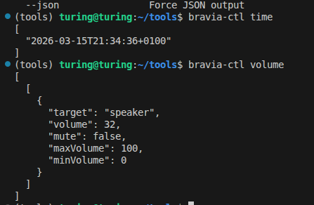
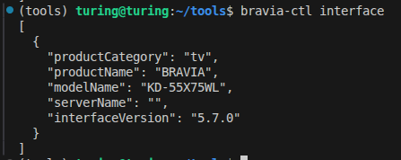

# bravia-ctl

A command-line tool for controlling Sony Bravia Android TVs over the network via their undocumented REST API. Built by [@lestwastaken](https://github.com/lestwastaken) during OSCP studies after discovering an exposed API surface on a Sony TV in my home lab.

## Discovery

While running a full port scan on my home network as part of OSCP exam prep, I found a Sony Bravia KD-55X75WL TV exposing **17 open TCP ports**:

```
$ nmap -sV -p- 192.168.2.81

PORT      SERVICE         VERSION
80/tcp    http            nginx
6466/tcp  ssl/unknown     atvremote (Android TV Remote)
6467/tcp  ssl/unknown     atvremote
7000/tcp  rtsp            AirTunes rtspd
8008/tcp  http            Google Cast
8009/tcp  ssl/castv2      Chromecast driver
8443/tcp  ssl/https-alt   Google Cast (SSL)
9000/tcp  ssl/cslistener
9080/tcp  glrpc           NRDP/2025.2.2.0 (Netflix)
33753/tcp upnp            Sony Bravia DLNA
36655/tcp unknown         HTTP 470 "Connection Authorization Required"
45183/tcp unknown         eSDK server
52323/tcp upnp            UPnP DMR (Sony "Huey Sample DMR")
56210/tcp upnp            UPnP MINT-X
...
```

**These ports are open by default on any Sony Bravia Android TV out of the box.** No user configuration is required to expose them — they are enabled the moment the TV connects to a network.

Port 80 serves a Sony REST API at `/sony/*` with JSON-RPC endpoints for full TV control — power, volume, apps, inputs, IRCC remote simulation, screenshots, and more. Any device on the same LAN can reach these endpoints.

## Security Finding: Bruteforceable 4-Digit Pairing PIN

I discovered that the Sony Bravia PIN pairing mechanism is vulnerable to brute force. The core flaw: **the TV does not rotate the PIN after a failed attempt**. The same PIN stays valid for the entire duration of the dialog, allowing an attacker to try all 10,000 combinations against a single PIN.

- The TV uses a **4-digit PIN** for device pairing (only 10,000 combinations)
- **The PIN does not change on failure** — the same PIN remains valid until the dialog times out or is dismissed
- There is **no rate limiting** on PIN attempts
- There is **no lockout** after failed attempts
- The dialog can be **re-triggered programmatically** via the API if it times out
- At ~50 attempts/second, the entire keyspace is exhausted in **~3-4 minutes**
- Any device on the **same network** can initiate this attack

A secure implementation would generate a new PIN after each failed attempt, making brute force statistically infeasible within a single dialog session. Instead, Sony keeps the same PIN alive, turning a 1-in-10,000 guess into a guaranteed crack.

Once a valid PIN is found, the TV issues a **persistent auth cookie** that never expires, granting full control: power, volume, app launching, screenshots, input switching, browser control, rebooting, and more.

The Pre-Shared Key (PSK) authentication provides a two-tier access model:

**PSK only (read-only, no pairing needed):**
- Power status (on/standby)
- Current volume and mute state
- HDMI/external input list and connection status
- All IRCC remote control codes
- Firmware version and interface info
- TV clock
- Content URI schemes
- App running status
- Speaker configuration
- Supported system functions
- Encryption public key
- Video/screen settings (banner mode, PIP position)
- Full API method enumeration

**Cookie (after cracking the PIN — full control):**
- Everything above, plus:
- Power on/off and reboot
- Volume control and mute/unmute
- Switch HDMI inputs
- List and launch apps (Netflix, YouTube, etc.)
- Send any remote button press
- Take screenshots of what's on screen
- Open URLs in the TV browser
- Type text into input fields
- Read network configuration, serial number, MAC address
- Read parental settings and favorites
- Access installed app list

This was found independently during my own security research on my own hardware.

## Supported Models

Confirmed working:
- **Sony Bravia KD-55X75WL** (Android TV, 2023)

Likely compatible with any Sony Bravia Android TV that exposes the `/sony/*` REST API, including:
- KD-xxX75WL series
- KD-xxX80K/X85K series
- XR-xxA80J/A90J series
- KD-xxX720E/X750E and newer
- Any Sony TV running Android TV OS with IP Control enabled

The API is part of Sony's "Simple IP Control" / "IP Control" feature set. If your TV has **Settings > Network > Home Network > IP Control**, it likely supports this tool.

## Prerequisites

This project uses [uv](https://docs.astral.sh/uv/) for dependency management. uv is a fast Python package manager written in Rust — think of it as pip + venv + pyenv in one tool.

### Installing uv

**Linux / macOS / WSL:**
```bash
curl -LsSf https://astral.sh/uv/install.sh | sh
```

**Windows (PowerShell):**
```powershell
powershell -ExecutionPolicy ByPass -c "irm https://astral.sh/uv/install.ps1 | iex"
```

**Homebrew (macOS / Linux):**
```bash
brew install uv
```

**pipx:**
```bash
pipx install uv
```

After installing, restart your terminal and verify:
```bash
uv --version
```

### Installing Python (via uv)

uv can manage Python versions for you — no need for pyenv or manual installs:

```bash
# Install the required Python version (3.12+)
uv python install 3.12

# Verify
uv python list
```

## Installation

### With uv (recommended)

```bash
# Clone the repo
git clone https://github.com/lestwastaken/bravia-ctl.git
cd bravia-ctl

# Create venv + install dependencies + install bravia-ctl in one step
uv sync

# Run it
uv run bravia-ctl --help

# Or activate the venv and use directly
source .venv/bin/activate   # Linux/macOS
# .venv\Scripts\activate    # Windows
bravia-ctl --help
```

### With pip

```bash
git clone https://github.com/lestwastaken/bravia-ctl.git
cd bravia-ctl

# Create a virtual environment
python -m venv .venv
source .venv/bin/activate   # Linux/macOS
# .venv\Scripts\activate    # Windows

# Install
pip install .

bravia-ctl --help
```

### System-wide (pipx)

```bash
pipx install git+https://github.com/lestwastaken/bravia-ctl.git
bravia-ctl --help
```

## Quick Start

```bash
# Create a .env file with your TV's IP (or use --host each time)
echo "BRAVIA_HOST=192.168.2.81" > .env

# Step 1: Find the PSK (no interaction needed, silent)
bravia-ctl auth bruteforce-psk
# Found PSK: 0000

# Save it to .env so you don't have to pass it every time
echo "BRAVIA_PSK=0000" >> .env

# Step 2: See what you can access with PSK only
bravia-ctl auth test

# Step 3: Get full control by bruteforcing the 4-digit pairing PIN
# This triggers a PIN dialog on the TV, then cracks it in ~3-4 minutes
bravia-ctl auth bruteforce-pin

# Done — you now have a persistent auth cookie and full control
bravia-ctl power on
bravia-ctl volume set 50
bravia-ctl app list
bravia-ctl key home
bravia-ctl screenshot
```





## Configuration

Configuration is resolved in this order (highest wins):

1. **CLI flags**: `--host`, `--psk`, `--timeout`
2. **Environment variables**: `BRAVIA_HOST`, `BRAVIA_PSK`, `BRAVIA_TIMEOUT`
3. **`.env` file** in the current directory

Create a `.env` file in the project root:
```env
BRAVIA_HOST=192.168.2.81
BRAVIA_PSK=0000
```

Then just run commands without flags:
```bash
bravia-ctl power
bravia-ctl auth test
```

## Commands

### Authentication

| Command | Description |
|---------|-------------|
| `auth bruteforce-psk` | Crack the PSK by trying common values (silent, no TV interaction) |
| `auth bruteforce-pin` | Crack the 4-digit pairing PIN to get full control (~3-4 min) |
| `auth test` | Map which methods work with PSK vs need PIN pairing |
| `auth pair` | Manual PIN pairing (if you can read the PIN off the TV screen) |

### Reconnaissance (PSK only)

| Command | Description |
|---------|-------------|
| `power` | Power status (on/standby) |
| `volume` | Current volume and mute state |
| `input list` | HDMI ports and connection status |
| `remote-codes` | Dump all IRCC remote button codes |
| `schemes` | Content URI schemes |
| `sources [scheme]` | Content sources |
| `time` | TV clock |
| `interface` | Firmware version and product info |
| `supported` | Supported system functions |
| `speaker` | Speaker configuration |
| `publickey` | Encryption public key |
| `screen` | Video/PIP settings |
| `probe` | Enumerate all API services and methods |
| `apis` | List all supported API methods |
| `powersaving` | Power saving mode |

### Control (requires PIN pairing)

| Command | Description |
|---------|-------------|
| `power on/off` | Power on/off |
| `volume set N` | Set volume (0-100) |
| `volume mute/unmute` | Mute/unmute |
| `input set URI` | Switch input (e.g. `extInput:hdmi?port=1`) |
| `app list` | List installed apps with URIs |
| `app launch URI` | Launch app by URI |
| `key NAME` | Send remote button press |
| `key --list` | List all available remote keys |
| `ircc CODE` | Send raw IRCC base64 code |
| `screenshot` | Capture TV screen |
| `browser open URL` | Open URL in TV browser |
| `textform TEXT` | Type text into active field |
| `reboot` | Reboot the TV |
| `info` | System info (model, serial, MAC) |
| `network` | Network configuration |
| `content URI` | Browse content at URI |

### Key Names

Remote control simulation via IRCC supports 100+ keys:

```
back, blue, channeldown, channelup, confirm, down, enter, exit,
forward, green, guide, hdmi1-4, home, info, input, left, mute,
netflix, next, num0-9, options, pause, play, playpause, poweroff,
prev, rec, red, return, rewind, right, stop, subtitle, up,
volumedown, volumeup, wakeup, yellow, youtube, ...
```

Use `bravia-ctl key --list` for the complete list.

The IRCC codes included in this tool were extracted from a Sony Bravia KD-55X75WL. If a key doesn't work on your TV model, you can fetch the correct codes directly from your TV:

```bash
bravia-ctl remote-codes
```

This queries `getRemoteControllerInfo` on the TV and dumps every IRCC code it supports. If your model has different codes, open a PR or issue with the output and I'll add them.

## API Protocol

The TV exposes a JSON-RPC API at `http://<TV_IP>/sony/<service>`:

| Service | Purpose |
|---------|---------|
| `system` | Power, device info, network, remote codes, screenshots |
| `avContent` | Input switching, content lists, playback |
| `audio` | Volume, mute, speaker settings |
| `appControl` | App management, text input |
| `videoScreen` | Picture modes, PIP, multi-screen |
| `guide` | API discovery |
| `encryption` | Public key retrieval |
| `accessControl` | Device registration (PIN pairing) |
| `cec` | HDMI-CEC control |
| `browser` | Browser URL control |

### Authentication

**Pre-Shared Key (PSK)**: Sent as `X-Auth-PSK` header. Provides read-only access. Common defaults include `0000`, `1234`, `sony`. Can be cracked with `auth bruteforce-psk`.

**Cookie auth**: Obtained via PIN pairing through `/sony/accessControl`. The TV generates a 4-digit PIN that does not change on failed attempts, making it trivially bruteforceable (see [Security Finding](#security-finding-bruteforceable-4-digit-pairing-pin)). The cookie never expires -- crack once, control forever.

### IRCC (Infrared Compatible Control)

Remote control commands are sent via SOAP/XML to `/sony/ircc`, simulating IR remote button presses over the network.

## Logging

```bash
bravia-ctl -v power     # verbose (INFO)
bravia-ctl -d power     # debug (full HTTP request/response)
```

## Disclaimer

**This tool is intended for authorized security testing and educational purposes only.**

- Only use it on devices you **own** or have **explicit written permission** to test
- Unauthorized access to computer systems and networks is **illegal** in most jurisdictions
- The author is not responsible for any misuse of this tool
- By using this tool, you agree to use it in compliance with all applicable laws and regulations

This project was developed as part of personal OSCP exam preparation and home lab research. All testing was performed on the author's own hardware.

## Contributing

If something doesn't work on your TV model, or you want to add support for new features:

- Open a [pull request](https://github.com/lestwastaken/bravia-ctl/pulls)
- File an [issue](https://github.com/lestwastaken/bravia-ctl/issues)
- Reach out to me on GitHub: [@lestwastaken](https://github.com/lestwastaken)

Different Bravia models may have different API methods, IRCC codes, or auth behavior. If you test on a model not listed above, let me know and I'll add it to the supported list.

## Author

Built by [@lestwastaken](https://github.com/lestwastaken) while studying for the OSCP certification. Found this TV sitting on my network, scanned it, and realized the entire REST API was wide open to anyone on the LAN.

## License

MIT
